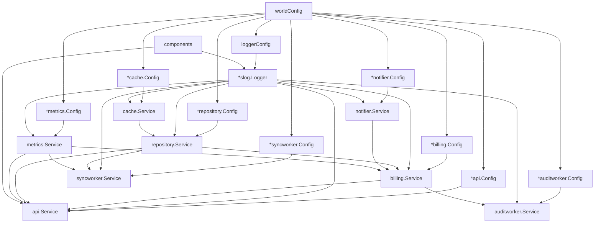

# lifecycle/example

This folder is a full DI + lifecycle demo for `dirt`.

It demonstrates:
- `ProvideStruct` / `ProvideCtor` / `ProvideValue`
- pointer-based config wiring
- `PostInject()` initialization hooks
- background services (`Run(ctx)`)
- `Invoke` first, then `lifecycle.DirtAddAll`

## Run

```bash
go run ./lifecycle/example
```

## Usage Map (feature -> file)

| Feature | Example file(s) | Notes |
|---|---|---|
| Custom logger dependency (`*slog.Logger`) via `ProvideCtor` | [`main.go`](./main.go) | `loggerConfig` + `newSlogLogger`, with `.With("service-name", ...)` and `slog.Level` |
| Pointer config providers (`ProvideValue(&Config{})`) | [`api/service.go`](./api/service.go), [`metrics/service.go`](./metrics/service.go), [`cache/service.go`](./cache/service.go), [`repository/service.go`](./repository/service.go), [`notifier/service.go`](./notifier/service.go), [`billing/service.go`](./billing/service.go), [`auditworker/service.go`](./auditworker/service.go), [`syncworker/service.go`](./syncworker/service.go) | Each service package owns its own config type |
| Root config aggregation with `ProvideStruct` | [`main.go`](./main.go) | `type worldConfig struct { ... }` holds pointers to all configs and sets concrete values in `main()` |
| Partial app root bundle with `ProvideStruct` | [`main.go`](./main.go) | `type components struct { logger *slog.Logger; api *api.Service }` |
| Constructor-based service wiring (`ProvideCtor`) | [`notifier/service.go`](./notifier/service.go), [`syncworker/service.go`](./syncworker/service.go) | Shows non-struct constructor patterns |
| Struct-field DI wiring (`ProvideStruct`) | [`api/service.go`](./api/service.go), [`billing/service.go`](./billing/service.go), [`cache/service.go`](./cache/service.go), [`repository/service.go`](./repository/service.go), [`metrics/service.go`](./metrics/service.go), [`auditworker/service.go`](./auditworker/service.go) | Unexported dependency fields with `dirt:""` tags |
| `PostInject()` hook | [`cache/service.go`](./cache/service.go), [`metrics/service.go`](./metrics/service.go), [`billing/service.go`](./billing/service.go) | Initializes internal maps/resources after injection |
| Background services | [`auditworker/service.go`](./auditworker/service.go), [`syncworker/service.go`](./syncworker/service.go) | `Run(ctx)` loop with ticker and graceful stop |
| Invoke then lifecycle collect | [`main.go`](./main.go) | `dirt.Invoke[*components]()` before `lc.DirtAddAll(dirt.GlobalScope())` |

## Dependency Graph



## Lifecycle Flow

1. `Invoke[*worldConfig]()` to get all config pointers.
2. Set real config values in `main()`.
3. `Invoke[*components]()` to force key service graph creation.
4. `lc.DirtAddAll(dirt.GlobalScope())` to collect invoked instances into lifecycle.
5. `lc.Main(ctx)` to run startup/run/shutdown.
